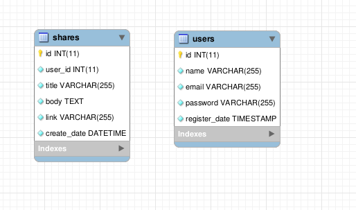
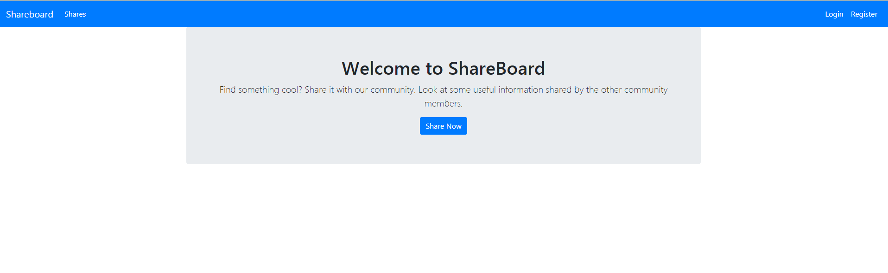
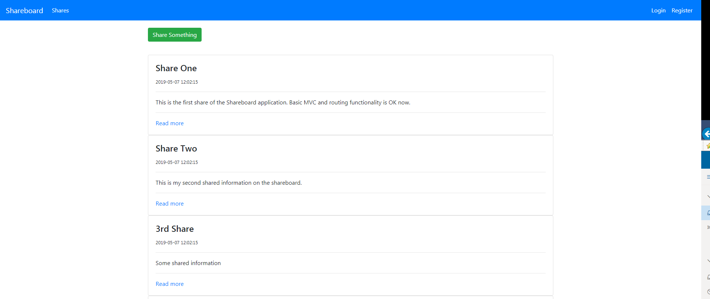
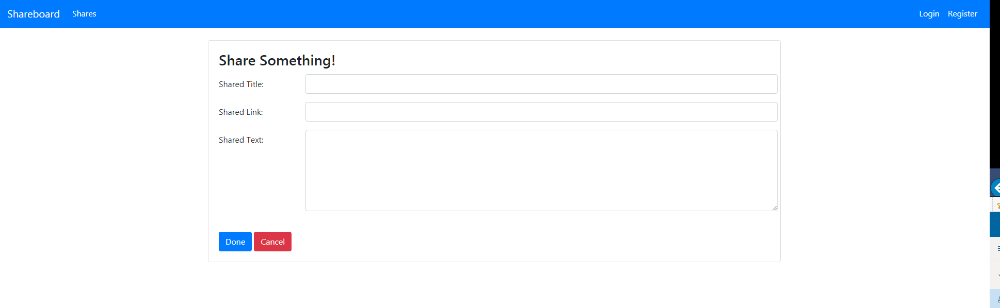
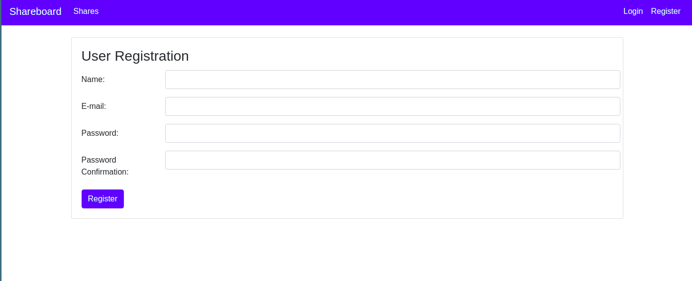

# Shareboard

## Intro

OOP PHP learning project using a mini framework and MVC.

## Requirements

- PHP7
- PHP-PDO
- PDO-mysql
- MySQL or MariaDB server
- Apache configured with homedir and rewrite module
- Bootstrap 4 (at least the CSS file)

## Installation
- Unzip or clone the repository to your homedir or to your webserver's DocumentRoot
- Enable userdir, .htaccess usage and rewrite modules in Apache config
- Run create_schema.sql as root
```bash
mysql -u root -p <create_schema.sql
```
- Run create_db_user.sql as root
```bash
mysql -u root -p <create_db_user.sql
```

## Database schema


## Screenshots

### Main screen


### Shares


### Add new share


### Registration form


