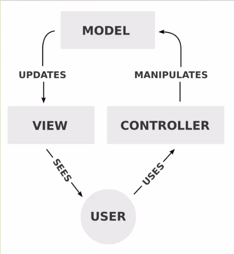
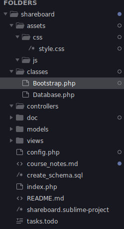

# OOP in PHP

## Basic OOP

### Method and property visibility

- public: Accessible outside of class

- protected: Accessible in class and any extended classes

- private: Accessible ONLY in the owner class

### Instantiate and use a class

Create an instance

```php
$classinst = new MyClass();
```

Example of class usage and definition

```php
<?php

// Define the class and the methods
class User {
    // Initialization of class properties are here
    // Call for the parent's constructor(s) (if any) also go(es) here
    public function __construct() {
        echo 'Constructor called.';
    }

    public function register() {
        echo 'User registered';
    }

    public function login($username, $password) {
        $this->auth_user($username, $password);
        echo $username . 'is logged in.';
    }

    public function auth_user($username, $password) {
        echo $username . ' is authenticated';
    }

    // Destructor syntax
    public function __destruct() {
        // put code here to free resources, close files, ect.
        // close databases for example
        echo 'Destructor called.';
    }
}

// Instantiate
$user = new User;

// Method call examples
$user->register();
$user->login('user1', 'userpass');
```

### Class properties and access modifiers

```php
class User {
    private $id = 33;
    private $username;
    private $email;
    private $password;

    public function __construct($username, $password) {
        $this->username = $username;
        $this->password = $password;
    }

    public function login($username, $password) {
        $this->username = $username;
        $this->password = $password;
        $this->auth_user();
    }

    public function auth_user() {
        echo $this->username . ' is authenticated';
    }
}

$user = new User('testuser', 'pass');
```

### Getters and Setters

```php
<?php
class Post {
    private $name;

    public function __set($name, $value) {
        echo 'Setting '.$name.' to <strong>'.$value.'</strong><br/>';
        $this->name = $value;
    }

    public function __get($name) {
        echo 'Getting '.$name.'<br/>';
        return $this->name;
    }

    public function __isset($name) {
        echo 'Is '.$name.' set?';
        return isset($this->name);
    }
}

$post = new Post;
$post->name = 'Testing';
echo $post->name;
var_dump(isset($post->name));
```

### Class inheritance

```php
<?php

class First {
    public $id = 23;
    public $name = 'John Doe';
    private $test = false;

    public function saySomething() {
        echo 'Something...';
    }
}

class Second extends First {
    public function getName() {
        return $this->name;
    }
}

$second = new Second;

// Example calls from the Second class inherited properties
echo $second->name;
echo $second->saySomething();
echo $second->test; // error! private property
echo $second->getName(); // ok## Advanced OOP
```

## Advanced OOP

### Static properties and methods

```php
<?php

class User {
    public $username;
    public static $minPassLength = 5;

    public static function validatePassword($password) {
        if (strlen($password) >= self::$minPassLength) {
            return true;
        } else {
            return false;
        }
    }
}

$password = 'pass';
if (User::validatePassword($password)) {
    echo 'Password is valid';
} else {
    echo 'Password is not valid';
}

echo User::$minPassLength;
```

### Abstract classes and methods

The abstract class is a base class and you cannot instantiate an abstract class. You have to extend them and use the inherited classes.

```php
<?php

abstract class Animal {
    public $name;
    public $color;

    public function describe() {
        return $this->name.' is '.$this->color;
    }
}

class Duck extends Animal {
    public function describe() {
        return parent::describe();
    }

    public function makeSound() {
        return 'Quack';
    }
}

class Dog extends Animal {
    public function makeSound() {
        return 'Bark';
    }
}

$animal = new Duck();
$animal->name = 'Ben';
$animal->color = 'Yellow';
echo $animal->describe();
echo $animal->makeSound();
```

### Class autoloading

First file: foo.php

```php
<?php
class Foo {
  public function sayHello() {
     echo 'Hello world';
  }
}
?>
```

Second file: bar.php

```php
<?php
class Bar {
  public function sayHello() {
     echo 'Hello world from Bar';
  }
}
?>
```

Another file: index.php

```php
<?php
//include 'foo.php';
//include 'bar.php';
spl_autoload_register(function($class_name) {
  include $class_name . '.php';
});

$foo = new Foo;
$bar = new Bar;

$foo->sayHello();
```

### final keyword

You can use this keyword to disable overloading a class or a method.

```php
class Foo {
  final public function() {
  }
}

final class Bar {
}
```

### Object iteration

$person4 and $person5 is unreachable outside the class but we can define a function _iterateObject()_ to reach all internal variables.

```php
<?php

class People {
    public $person1 = 'Mike';
    public $person2 = 'Shelly';
    public $person3 = 'Jeff';

    protected $person4 = 'John';
    private   $person4 = 'Jen';

    public function iterateObject()
    {
        foreach ($this as $key => $value) {
            print "$key => $value\n";
        }
    }
}

$people = new People;
$people->iterateObject();
```

## Database handling with PDO

### PDO Database: class & Connection

See classes/Database.php as an example.

### PDO Database: bind parameters and fetch the data

See classes/Database.php : query(), bind(), execute() and resultset() functions.

PHP foreach inside HTML

```php
<?php foreach($rows as $row) : ?>
    <div>
        <h3><?php echo $row['title']; ?></h3>
        <p><?php echo $row['body']; ?></p>
    </div>
<?php endforeach; ?>
```

## The Project: Shareboard

### MVC schema



### Folder structure of an MVC application



### Rewrite rule for routing the requests to the controllers and call the proper actions

Enter these lines to __<APP_ROOT>/.htaccess__ and enable the Options in the global webserver configuration:

```
RewriteEngine on
RewriteRule ^([a-zA-Z]*)/?([a-zA-Z]*)?/?([a-zA-Z0-9]*)?/?$ index.php?controller=$1&action=$2&id=$3 [NC,L]
```

The Bootstrap class resolves the controller and the action and creates the corresponding Controller based on the QUERY_STRING parameter of the request.

```php
<?php

class Bootstrap{
    private $controller;
    private $action;
    private $request;

    public function __construct($request){
        $this->request = $request;
        if($this->request['controller'] == ""){
            $this->controller = 'home';
        } else {
            $this->controller = $this->request['controller'];
        }
        if($this->request['action'] == ""){
            $this->action = 'index';
        } else {
            $this->action = $this->request['action'];
        }
    }

    public function createController(){
        // Check Class
        if(class_exists($this->controller)){
            $parents = class_parents($this->controller);
            // Check Extend
            if(in_array("Controller", $parents)){
                if(method_exists($this->controller, $this->action)){
                    return new $this->controller($this->action, $this->request);
                } else {
                    // Method Does Not Exist
                    echo '<h1>Method does not exist</h1>';
                    return;
                }
            } else {
                // Base Controller Does Not Exist
                echo '<h1>Base controller not found</h1>';
                return;
            }
        } else {
            // Controller Class Does Not Exist
            echo '<h1>Controller class does not exist</h1>';
            return;
        }
    }
}
```

### The main loop of the Share card view

See the commented lines if you want to display the information as unordered list. I prefer the basic flow of the page.

```html
<?php foreach($viewmodel as $item) : ?>
        <!-- <li> -->
        <div class="btn btn-info text-left btn-share">
            <h4><?php echo $item['title']; ?></h4>
            <span><small><?php echo $item['create_date']; ?></small></span>
            <!-- <span class="text-right"><small><?php echo $item['user_id']; ?></small></span> -->
            <hr />
                <div class="form-control">
                    <?php echo $item['body']; ?>
                </div>
                <hr />
                <a class="btn btn-success" href="<?php echo $item['link']; ?>" target='_blank'>Go To Website</a>
        </div>
        <!-- </li> -->
    <?php endforeach; ?>
```

## Additional features

### Static function of Bootstrap for disabling browser side cache

```php
    public static function disableCache() {
        header( 'Expires: Sat, 26 Jul 1970 05:00:00 GMT' ); 
        header( 'Last-Modified: ' . gmdate( 'D, d M Y H:i:s' ) . ' GMT' ); 
        header( 'Cache-Control: no-store, no-cache, must-revalidate' ); 
        header( 'Cache-Control: post-check=0, pre-check=0, max-age=0, s-maxage=0', false ); 
        header( 'Pragma: no-cache' );       
    }
```

### Using the Messages class

```php
// Somewhere if you need to display a flash message
Messages::setMsg('Some text', 'danger|warning|success|info');

// In the main view page
Messages::display();
